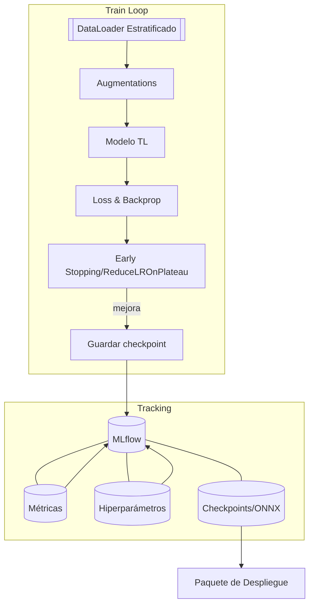

# Diseño del Modelo y Arquitectura

## 1. Propósito y Alcance
Diseñar una arquitectura reproducible y escalable para un sistema de apoyo al diagnóstico de cáncer de tiroides mediante ecografías, priorizando interpretabilidad clínica, eficiencia computacional y buenas prácticas de ingeniería de datos/modelos.

**Objetivos específicos**
- Establecer un pipeline de datos estandarizado y medible.
- Definir el modelo base (transfer learning) y el proceso de optimización.
- Incorporar interpretabilidad (Grad-CAM) y criterios de aceptación centrados en recall de la clase maligna.
- Preparar artefactos de despliegue (ONNX/TFLite) para hardware de bajos recursos.

---

## 2. Visión General de la Arquitectura

```mermaid
flowchart LR
    A[Ingreso de Imágenes Ecográficas] --> B[Preprocesamiento: normalización, resize, CLAHE]
    B --> C[Partición Estratificada: train/val/test]
    C --> D[Modelo Base: EfficientNetB0/ResNet50]
    D --> E[Entrenamiento y Fine-tuning]
    E --> F[Evaluación: F1 macro, Recall maligna, Matriz de confusión]
    E --> G[Interpretabilidad: Grad-CAM]
    F --> H[Exportación: ONNX / TFLite]
    G --> H
    H --> I[Inferencia en CPU Estándar / Edge]
    I --> J[Reporte Clínico + Evidencias (mapas Grad-CAM)]
```

---

## 3. Pipeline de Datos

**3.1. Estandarización**
- Lectura a escala de grises y normalización a [0, 1] o z-score por imagen.
- Redimensionado a 224×224 con *padding* para preservar relación de aspecto.
- Aumento de datos estratificado por clase minoritaria: rotaciones ±10°, *horizontal flip*, recortes aleatorios conservadores, leves ajustes de brillo/contraste.

**3.2. Control de calidad y gobernanza**
- Métricas técnicas por imagen: nitidez (varianza del Laplaciano), contraste (desviación estándar), intensidad media.
- Detección de duplicados/*near-duplicates* vía *perceptual hashing* previo al *split*.
- Partición reproducible `70/20/10` con estratificación; fijar `random_state`.

**3.3. Esquema de metadatos (mínimo)**
- `path`, `class`, `width`, `height`, `aspect_ratio`, `sharpness`, `mean_intensity`, `std_intensity`, `source`.

---

## 4. Diseño del Modelo

**4.1. Selección**
- **Baseline**: EfficientNetB0 preentrenado en ImageNet con *feature extractor* congelado parcialmente.
- Alternativa: ResNet50 (para comparación de *bias-variance* y sensibilidad a artefactos).
- Capa de salida: softmax con 3 clases (benigno, maligno, normal) o binario según objetivo final.

**4.2. Preprocesamiento específico del modelo**
- Normalización con estadísticas del *backbone* (ImageNet) o recalibración por canal para imágenes en escala de grises replicando canal a RGB.

**4.3. Fine-tuning**
- Estrategia en dos etapas:
  1) Calibración de la capa clasificador con *backbone* congelado.
  2) Descongelado gradual de bloques superiores (último 25–30 %) con *low LR*.
- Regularización: *early stopping*, *weight decay*, *label smoothing* opcional.

**4.4. Hiperparámetros (valores de partida)**
- Batch size: 16–32
- LR etapa 1: 1e-3; LR etapa 2: 1e-4
- Optimizador: AdamW
- Épocas objetivo: 20–40 (con *early stopping* por F1 macro en validación)

---

## 5. Interpretabilidad y Validación

**5.1. Interpretabilidad (XAI)**
- Grad-CAM por clase positiva y mapas normalizados superpuestos a la ecografía.
- Almacenamiento de mapas en validación y test para revisión clínica.

**5.2. Métricas y umbrales**
- Principales: F1 macro, Recall clase maligna (prioritaria), Precision clase benigna.
- Eficiencia: tiempo de inferencia en CPU (< 2 s objetivo).
- Curvas ROC/AUC por clase como métrica secundaria.
- Matriz de confusión y análisis de errores por patrón anatómico/artefactos.

**5.3. Criterios de aceptación**
- Mínimos: F1 macro ≥ 0,85; Recall maligna ≥ 0,90; inferencia < 5 s/imagen.
- Excelencia: F1 macro ≥ 0,92; Recall maligna ≥ 0,95; inferencia < 2 s/imagen.

---

## 6. Arquitectura de Entrenamiento y MLOps Ligero



**Buenas prácticas**
- Versionado de datos y *splits* (manifiesto de archivos).
- Registro de experimentos (MLflow o equivalente).
- Pruebas unitarias para *dataloader* y posprocesamiento (umbralización, agregación de logits).
- Semillas y determinismo hasta donde sea posible.

---

## 7. Despliegue y Operación

**7.1. Formatos y entorno**
- Exportación: ONNX (runtime en CPU) y TFLite (opción móvil/edge).
- *Wrapper* de inferencia: CLI y/o microservicio HTTP con validación de entrada y control de versiones.

**7.2. Flujo de inferencia**
1) Validación y normalización de imagen de entrada.
2) Inferencia en modelo optimizado.
3) Generación de Grad-CAM asociado.
4) Salida: clase predicha, probabilidades, mapa Grad-CAM, tiempo de proceso.

**7.3. Integración clínica**
- Generación de reporte PDF/HTML con predicción y evidencias visuales.
- Interoperabilidad futura: integración con PACS mediante API o conector intermedio.
- Controles de auditoría: registro de predicciones e imágenes de evidencia.

---

## 8. Seguridad, Ética y Cumplimiento
- Anonimización estricta de datos y metadatos.
- Control de acceso a modelos y artefactos.
- Documentación de límites del sistema y requisitos de supervisión médica.
- Plan de reducción de sesgo: análisis por subgrupos, *error analysis* por dominio, re-entrenamiento con datos adicionales equilibrados.

---

## 9. Escalabilidad y Mantenibilidad
- Separación de preocupaciones: módulos de datos, modelo, entrenamiento, evaluación, despliegue.
- Configuración por archivos YAML para reproducibilidad entre entornos.
- Posibilidad de *distillation* a modelos más ligeros (MobileNetV3, EfficientNet-Lite) si se requieren latencias menores.
- Roadmap de mejora: multimodalidad (datos clínicos) y validación clínica prospectiva.

---

## 10. Artefactos a Entregar
- `data_manifest.csv`: inventario y *splits*.
- `model_card.md`: ficha del modelo (versión, datos, métricas, límites).
- `inference_cli.py` y/o `service.py`: inferencia local o servicio.
- `model.onnx` y/o `model.tflite`: artefactos para despliegue.
- `xai_examples/`: mapas Grad-CAM de validación y test.
- `mlflow_run/`: registro de experimento y métricas.
